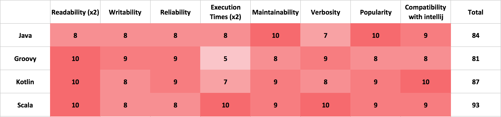
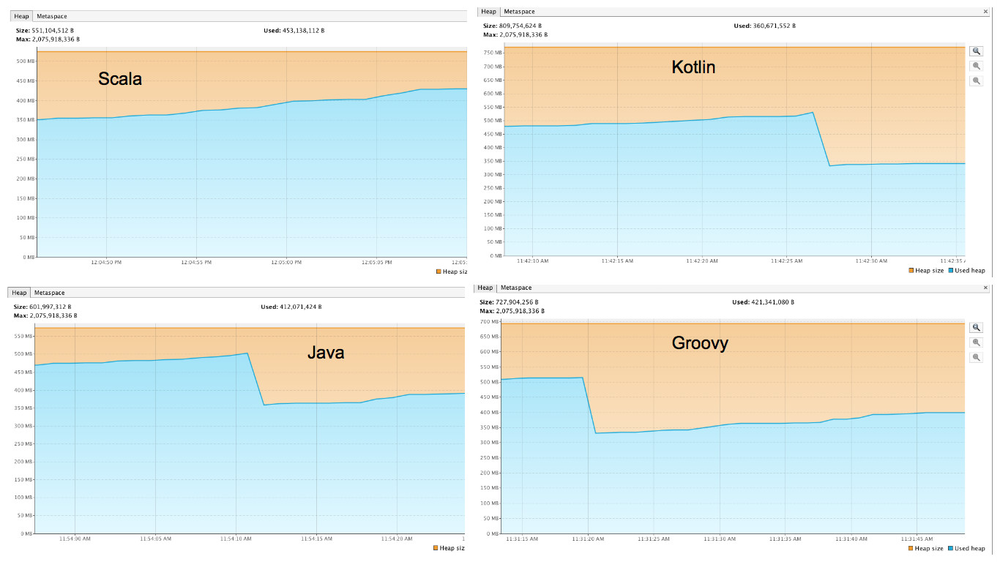

# What's our next JVM language?
<h2 style="text-align: center">:zap: Anushree Singh :zap:</h2>

-----------------------

<h2> Problem Statement</h2>

<h1>Explore and study new languages to make sure we are using the most efficient one</h1>

-----------------------

# Scope & Goals

- Understand the KG (Krazyglue) application
- Explore and find candidate JVM languages
- Refactor a part of KG to each of the candidate languages
- Compare the languages based on performance and other metrics
- Recommend a JVM language for KG

-----------------------

# What kind of application is krazyglue:

1. <del> Computation intensive </del>
2. <del>DB Intensive </del>
3. Request driven &#10004;

-----------------------

# Candidate languages

1. <b>Clojure</b>  &nbsp;&nbsp;&nbsp;&nbsp;&nbsp;&nbsp;General-purpose, Emphasis on functional programming
2. <b>Groovy</b>  &nbsp;&nbsp;&nbsp;&nbsp;&nbsp;&nbsp;Dynamic language with static-typing -  concise, easy to learn syntax
3. <b>Kotlin</b>  &nbsp; &nbsp;&nbsp;&nbsp;&nbsp;&nbsp;&nbsp;Statically typed for JVM, Android and the browser
4. <b>Scala</b>   &nbsp;&nbsp;&nbsp;&nbsp;&nbsp;&nbsp;&nbsp;&nbsp;General-purpose, Full support for functional programming

------------------------

# Choose a part of krazyglue to work on which:

- is of appropriate size
- is not strongly connected to other modules
- has some complex logic or language features

------------------------

 <h2> Point of Sale Retreiver </h2> 

------------------------

# Why is Clojure not a good fit

- OOPs to functional programming transformation.
- Challenging to work with Spring. Works better with other frameworks - Fleet or Hiccup.
- It is aimed for multithreaded and concurrent programs.
- Syntax is very different from Java.

------------------------

#  Non performance metrics 

------------------------

# Results: Non performance metrics 

------------------------

# Performance metrics 

------------------------

<h2> CPU Usage </h2>

 

<h3>&uarr; CPU usage = &#8595; performance</h3>

------------------------

<h2> Classes loaded </h2>

 

<h3>&uarr; Number of classes loaded = &#8595; performance</h3>

------------------------

<h2> Heap Size used </h2>

 

<h3>&uarr; heap size used = &#8595; performance</h3>

------------------------

<h2> Threads started </h2>

------------------------

# Results: Performance 

-----------------------

# Final Results 

-----------------------

# My Recommendation : SCALA

-----------------------

# Thank you! :v:

##The presentation can be found on: 

## This presentation has been made using markpress (https://www.npmjs.com/package/markpress).
